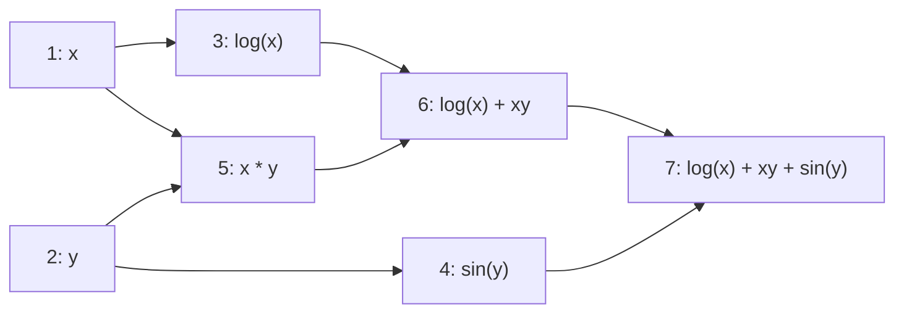

# Auto Diff Technical Report

This report documents my learnings about reverse-mode automatic differentiation (AD) and how a computational graph can be used to implement it in code.

## What is reverse-mode autodiff

Automatic differentiation is a technique for computing derivatives of functions expressed as programs. A developer writes regular code, and the autodiff system computes the derivatives of the final output with respect to the program’s inputs. Although the core ideas have existed for decades, they became central in modern machine learning because gradient-based optimization requires derivatives of models with large numbers of parameters.

The core mathematical tool is the chain rule. For a composition $g(f(x))$:

$$  
\frac{d}{dx}g(f(x)) = g'(f(x)) \cdot f'(x)  
$$

This shows that the derivative of a composite function can be broken into simpler derivatives and multiplied.

Autodiff also uses rules such as:

$$  
\frac{d}{dx}[f(x) + g(x)] = f'(x) + g'(x)  
$$

Reverse-mode autodiff applies these rules algorithmically. The main steps are:

1. **Forward pass:** compute the value of each intermediate operation and store the _local derivatives_ of that operation with respect to its inputs.
    
2. **Backward pass:** starting from the final output, propagate derivatives backward through the graph, using the stored local derivatives to accumulate the derivative of the output with respect to each intermediate value and ultimately with respect to each input.
    

Reverse-mode AD is efficient when the program has many inputs and a single scalar output, because one forward pass plus one backward pass is enough to compute all derivatives of the output with respect to all inputs.

## Example: computation graph for a scalar function

Consider the function:

$$  
f(x, y) = \log(x) + xy + \sin(y)  
$$

A computation graph breaks this expression into primitive operations:



Numbering the nodes:

- Node 1: input $x$
- Node 2: input $y$
- Node 3: $u = \log(x)$
- Node 4: $v = \sin(y)$
- Node 5: $w = x \cdot y$
- Node 6: $t = u + w$
- Node 7: $z = t + v$ (the final output)

### Forward pass

During the forward pass:

- Node 3 stores the local derivative $\partial u / \partial x = 1/x$.
- Node 4 stores $\partial v / \partial y = \cos(y)$.
- Node 5 stores $\partial w / \partial x = y$ and $\partial w / \partial y = x$.
- Node 6 stores local derivatives $1$ and $1$ for its two inputs.
- Node 7 stores local derivatives $1$ and $1$.

### Backward pass

To begin the backward pass, we set the derivative of the output with respect to itself to 1:

$$  
\frac{dz}{dz} = 1.  
$$

Then we traverse the graph in reverse topological order. For each node, we:

1. Take the derivative of the output with respect to that node (already accumulated).
2. Multiply it by the node’s stored local derivatives to compute how much each input contributed to the final output.
3. Add those contributions to the derivatives stored at each input node.

Because $y$ influences the output through both $xy$ and $\sin(y)$, node 2 receives derivative contributions from node 5 and node 4. Reverse-mode autodiff naturally handles this by accumulating contributions whenever multiple paths lead into a node.

By the time we finish, nodes 1 and 2 contain the final results:

- derivative of the output with respect to $x$
- derivative of the output with respect to $y$

## Implementation: a tiny reverse-mode engine in Python

To better understand reverse-mode autodiff, I implemented a minimal autodiff engine in Python. The central data structure is a `Tensor` that stores:

- its scalar `value`
- references to parent nodes `args`
- the `local_derivatives` with respect to those parents
- a `derivative` field, which will eventually store the derivative of the final output with respect to this tensor

Below is the implementation:

```python
from __future__ import annotations
from typing import Optional

class Tensor:
  
    def __init__(self, value: float, name: str = None):
        self.value = float(value)
        
        # Parents used to compute this tensor.
        self.args: tuple[Tensor] = None  

        # Local partial derivatives with respect to each parent.
        self.local_derivatives: tuple[Tensor] = None

        # Derivative of the final output with respect to this tensor.
        self.derivative: Optional[float] = None

        self.name = name

    # Build topological order of the computation graph.
    def build_topo(self, order: list[Tensor], visited: set[Tensor]):
        if self in visited:
            return
        visited.add(self)

        if self.args is not None:
            for arg in self.args:
                arg.build_topo(order, visited)

        order.append(self)  

    def backward(self):
        # The derivative of the output with respect to itself is 1.
        self.derivative = 1.0

        # Build the topological order leading to this node.
        order: list[Tensor] = []
        visited: set[Tensor] = set()
        self.build_topo(order, visited)

        # Work backward and accumulate derivatives.
        for node in reversed(order):
            if node.args is not None:
                for arg, local_derivative in zip(node.args, node.local_derivatives):
                    contrib = node.derivative * local_derivative.value
                    if arg.derivative is None:
                        arg.derivative = contrib
                    else:
                        arg.derivative += contrib

    def clear_derivatives(self):
        order: list[Tensor] = []
        visited: set[Tensor] = set()
        self.build_topo(order, visited)
    
        for node in order:
            node.derivative = None

    def __repr__(self) -> str:
        return f"Tensor(name={self.name}, value={self.value})"

    # Operator overloading for +, -, *
    def __add__(self, x: Tensor | int | float):
        if isinstance(x, Tensor):
            return _add(self, x)
        elif isinstance(x, (int, float)):
            return _add(self, Tensor(x))
        else:
            return NotImplemented

    def __radd__(self, x: Tensor | int | float):
        if isinstance(x, Tensor):
            return _add(x, self)
        elif isinstance(x, (int, float)):
            return _add(Tensor(x), self)
        else:
            return NotImplemented

    def __sub__(self, x: Tensor | int | float):
        if isinstance(x, Tensor):
            return _sub(self, x)
        elif isinstance(x, (int, float)):
            return _sub(self, Tensor(x))
        else:
            return NotImplemented

    def __rsub__(self, x: Tensor | int | float):
        if isinstance(x, Tensor):
            return _sub(x, self)
        elif isinstance(x, (int, float)):
            return _sub(Tensor(x), self)
        else:
            return NotImplemented

    def __mul__(self, x: Tensor | int | float):
        if isinstance(x, Tensor):
            return _mul(self, x)
        elif isinstance(x, (int, float)):
            return _mul(self, Tensor(x))
        else:
            return NotImplemented

    def __rmul__(self, x: Tensor | int | float):
        if isinstance(x, Tensor):
            return _mul(x, self)
        elif isinstance(x, (int, float)):
            return _mul(Tensor(x), self)
        else:
            return NotImplemented


def _add(a: Tensor, b: Tensor):
    result = Tensor(a.value + b.value)
    result.local_derivatives = (Tensor(1.0), Tensor(1.0))
    result.args = (a, b)
    return result

def _sub(a: Tensor, b: Tensor):
    result = Tensor(a.value - b.value)
    result.local_derivatives = (Tensor(1.0), Tensor(-1.0))
    result.args = (a, b)
    return result

def _mul(a: Tensor, b: Tensor):
    result = Tensor(a.value * b.value)
    result.local_derivatives = (b, a)
    result.args = (a, b)
    return result


def test(want: any, got: any):
    indicator = "✅" if want == got else "❌"
    print(f"{indicator}: want {want}, got {got}")
```

This system supports addition, subtraction, and multiplication. More operations (such as $\log$ or $\sin$) can be added by providing their value computations and their local derivatives.

---
## Worked Example: $f(x) = (x + 3) \cdot x$ at $x = 5$

To verify the correctness of the autodiff engine, consider the function:

$$  
f(x) = (x + 3) \cdot x  
$$

Evaluated at $x = 5$.

We compute the value and the derivatives using the engine and compare them to the analytic result.

### Forward pass

**1. Input**

```
x = Tensor(5, name="x")
value = 5
args = None
local_derivatives = None
```

**2. Compute x + 3**

```
a = x + Tensor(3)
value = 8
args = (x, Tensor(3))
local_derivatives = (1, 1)
```

In the engine, addition always stores `(1, 1)` as the local derivatives.

**3. Compute a * x**

```
f = a * x
value = 8 * 5 = 40
args = (a, x)
local_derivatives = (x, a)   # (5, 8)
```

### Backward pass

We now call:

```
f.backward()
```

**Initialization:**

```
f.derivative = 1.0  
```

**Backward through multiplication**

For `f = a * x`:

- contribution to `a` = $1.0 * x.value = 5$
- contribution to `x` = $1.0 * a.value = 8$

So now:

```
a.derivative = 5
x.derivative = 8
```

**Backward through addition**

For `a = x + 3`:

Local derivatives are `(1, 1)`.

Contribution to `x`:

```
x.derivative += a.derivative * 1 = 8 + 5 = 13
```

Contribution to constant `3`:

```
ignored for the final result (the engine computes it, but it is not needed for this example)
```

### Final result

The derivative of $f$ with respect to $x$ at $x=5$ is:

```
x.derivative = 13
```

### Manual derivative check

Analytically:

$$  
f(x) = x^2 + 3x  
$$

$$  
f'(x) = 2x + 3  
$$

At $x = 5$:

$$  
f'(5) = 2(5) + 3 = 13  
$$

This matches the autodiff engine’s result.

---
## Reverse-mode versus forward-mode

In forward-mode autodiff, each input variable must be followed separately through the entire computation. If a function has many inputs, forward-mode must make one full pass for each input to determine how a small change in that input affects the final output. This becomes expensive when the input dimension is large.

Reverse-mode works differently. During the forward pass, the program computes all intermediate values and stores the local derivatives at each node in the computation graph. Once those local derivatives are stored, a **single** backward pass is enough to determine the derivative of the final output with respect to _every_ input.

This works because the backward pass starts from the output and moves backward through the graph, sending derivative contributions to every node that influences the output. A single traversal of the graph reaches all input nodes, no matter how many there are, and each stored local derivative is reused exactly when needed. As a result, reverse-mode requires only one backward pass to compute all input derivatives, even when the number of inputs is large.

---
## Summary and reflections

Working through reverse-mode autodiff removed much of the “magic” I had assumed was happening behind the scenes. I had expected the system to store enormous amounts of information, but in practice each node only needs to keep track of its value, its inputs, and the local derivatives for that operation. This is far more lightweight than I originally believed.

I was also surprised by how compact the backward logic turned out to be. A small amount of code was enough to walk the computation graph in reverse and accumulate the derivative of the output with respect to every input. The simplicity of the implementation helped me understand why reverse-mode scales to large models.

Another important realization was that autodiff can handle any function that can be written in normal code, including loops and branches. As long as the computation can be represented as a graph of operations, the backward pass can traverse it.

Finally, I was struck by how old these ideas are. Reverse-mode autodiff has existed for decades, yet it took a long time before it became a central technique in machine learning. Seeing how straightforward the core mechanics are makes its late adoption surprising in hindsight.